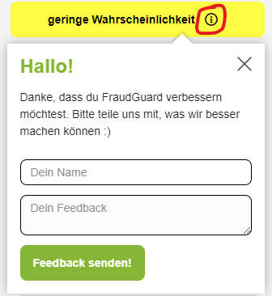

### **1**

Als Erstes besuchst du die Seite unseres Repositories, indem du den Link "https://github.com/FraudGuard/FraudGuard" in deinem Browser aufrufst.

### **2**

Um die Chrome-Erweiterung zu deinem Browser hinzuzufügen, musst du diese erst herunterladen. Dies machst du, indem du auf die neuste Version klickst.

### **3**

Hier musst du nun die Version für dein Betriebssystem herunterladen. Anschließend musst du die heruntergeladene Zip-Datei noch entpacken.

### **4**

Jetzt öffnest du deinen Chromebrowser und drückst oben rechts auf das Burger-Menü(⋮) -> Weitere Tools -> Erweiterungen.

### **5**

Nun musst du noch den "Entwicklermodus" aktivieren, weil unsere App noch nicht im Chrome Store veröffentlicht ist.

### **6**

Hier angekommen, klickst du dann auf "Entpackte Erweiterung laden" und wählst den Ordner mit der Bennenung "dist" aus, der in der Zip-Datei enthalten ist. Die Chrome-Erweiterung sollte jetzt geladen und einsatzbereit sein.

### **7**

Sobald du jetzt auf die eBay-Kleinanzeigen Webseite wechselst, werden die Anzeigen, welche wir bereits in der Datenbank gespeichert haben, mit einer Wahrscheinlichkeit markiert. Die analysierten Anzeigen werden in vier Kategorien eingestuft:

- Unwahrscheinlich,
- geringe Wahrscheinlichkeit,
- wahrscheinlich,
- sehr wahrscheinlich,

Ist das nicht der Fall, kannst du bei den noch nicht gespeicherten Anzeigen den Knopf drücken und es wird dann für diese Anzeige einen Score ermittelt.

### **8**

Wenn du auf der Ansichtsseite einer Anzeige bist, die noch keine Markierung hat, kannst du hier auf den "Anzeige prüfen" Knopf drücken, um die Betrugswahrscheinlichkeit ermitteln zu lassen.

Nachdem du den Knopf gedrückt hast, wird die analysierte Anzeigen in einer der vier Kategorien eingestuft. Du hast die Möglichkeit auf das Info-Icon zu drücken und uns Feedback zu geben.

