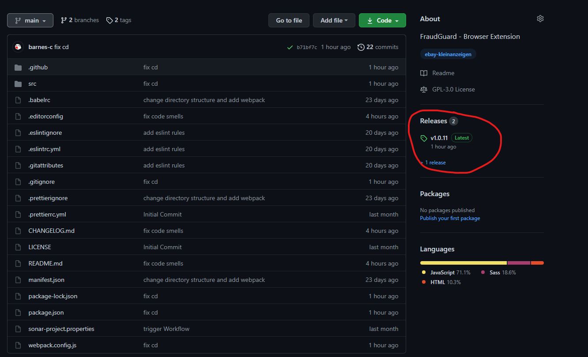
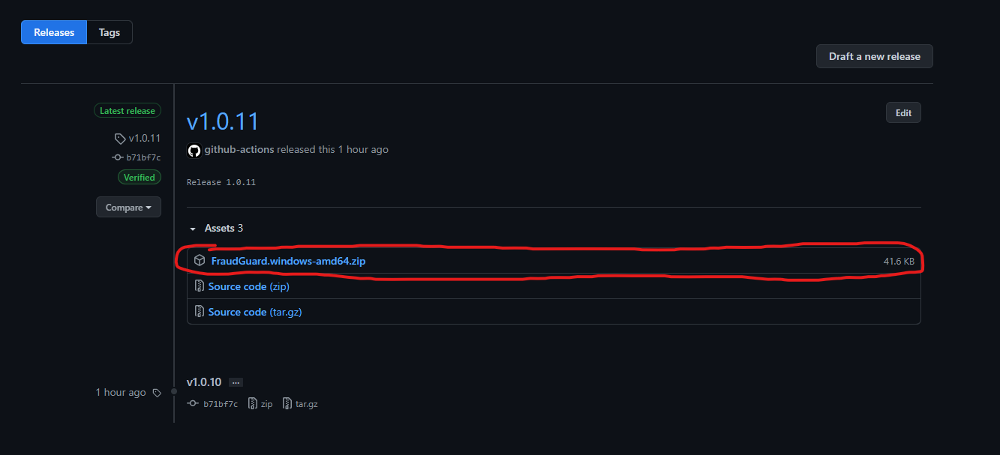
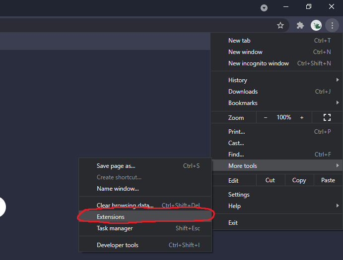
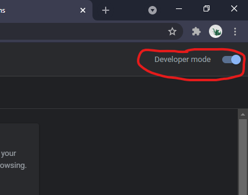
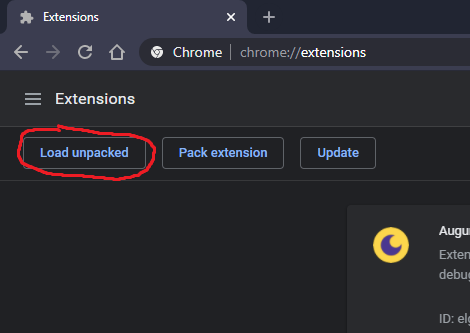
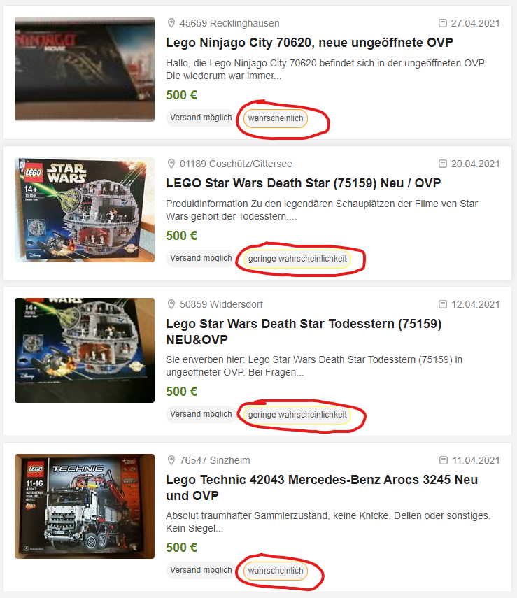
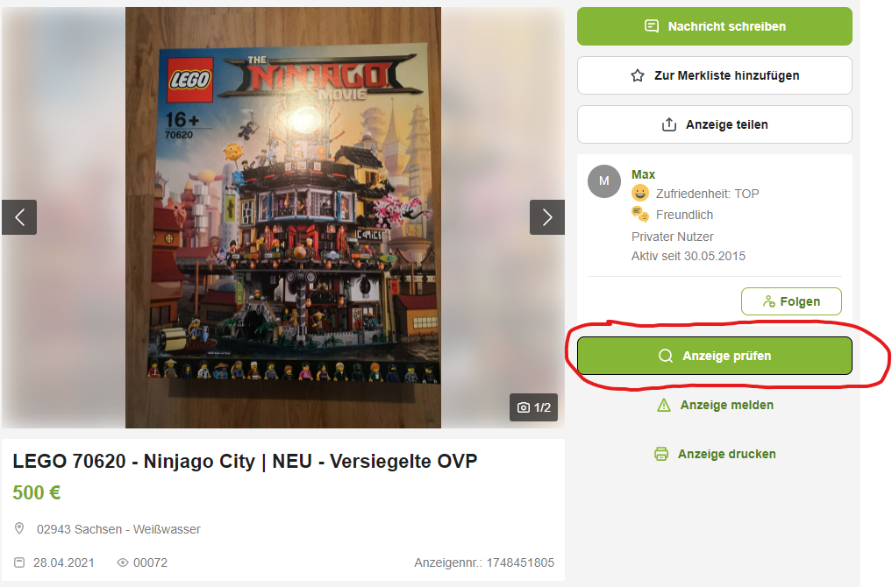
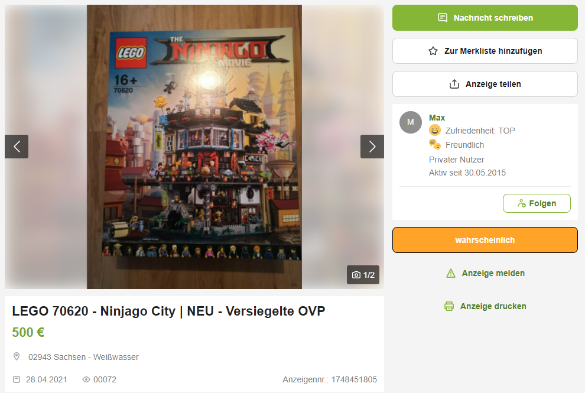

### **1**

Als Erstes besuchst du die Seite unseres Repositories, indem du den Link "https://github.com/FraudGuard/FraudGuard" in deinem Browser aufrufst.

### **2**

Um die Chrome-Erweiterung zu deinem Browser hinzuzufügen, musst du diese erst herunterladen. Dies machst du, indem du auf die neuste Version klickst.

### **3**

Hier musst du nun die Version für dein Betriebssystem herunterladen. Anschließend musst du die heruntergeladene Datei jetzt noch entpacken.

### **4**

Jetzt gehst du in deinen Chromebrowser und drückst oben rechts auf das Burger-Menü(⋮) -> Weitere Tools -> Erweiterungen.

### **5**

Nun musst du noch den "Entwicklermodus" aktivieren, weil unsere App noch nicht im Chrome Store veröffentlicht ist.

### **6**

Hier angekommen, klickst du dann auf "Entpackte Erweiterung laden" und wählst den dist-Ordner aus. Die Chrome-Erweiterung sollte jetzt geladen und einsatzbereit sein.

### **7**

Sobald du jetzt auf ebay-Kleinanzeigen bist sollten Anzeigen, welche wir bereits in der Datenbank haben mit einer Wahrscheinlichkeit markiert werden

### **8**

Falls du eine Anzeige siehst, welche keine Markierung hat, kannst du auf diese klicken und auf den "Anzeige prüfen" Knopf drücken. Dies kann manchmal länger dauern, weil wenn unser Server längere Zeit nicht genutzt wird in den Ruhemodus schaltet.

Nachdem du den Knopf gedrückt hast wird die analysierte Anzeigen in vier Kategorien eingestuft:

- Unwahrscheinlich,
- geringe wahrscheinlichkeit,
- wahrscheinlich,
- sehr wahrscheinlich,

